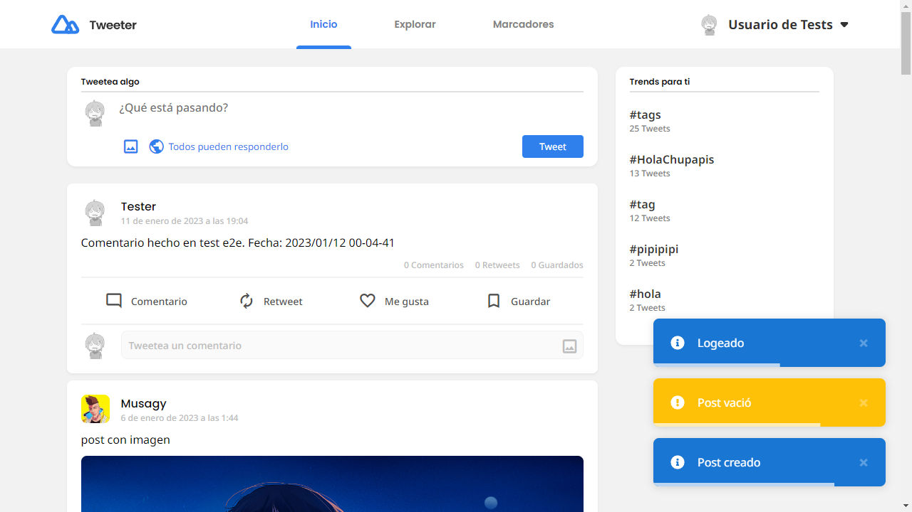

<h1 align="center">Tweeter</h1>

<div align="center">
   Solución para un reto de <a href="http://devchallenges.io" target="_blank">Devchallenges.io</a>.
</div>

<div align="center">
  <h3>
    <a href="https://tweeter-musagy.vercel.app">
      Demo
    </a>
    <span> | </span>
    <a href="https://github.com/Musagy/tweeter">
      Solution
    </a>
    <span> | </span>
    <a href="https://devchallenges.io/challenges/rleoQc34THclWx1cFFKH">
      Challenge
    </a>
  </h3>
</div>

<!-- TABLE OF CONTENTS -->

## Tabla de Contenido

- [Descripción general](#descripción-general)
- [Se construyo con](#se-construyo-con)
- [Como usarlo](#como-usarlo)
- [Contactos](#contactos)

<!-- OVERVIEW -->

## Descripción general



Este fue mi proyecto autodidacta mas difícil. Me tomo mucho tiempo y esfuerzo.
En especial porque quería tryhardear un poco con las tecnologías que use en este proyecto.
Entre estas aprender a profundidad Vue, aprender lo básico de docker, usar el orm prisma y aprender AWS o por lo menos S3.

### Se construyo con

- [Vue.js](https://vuejs.org/)
- [ExpressJS](https://expressjs.com/)
- [Typescript](https://www.typescriptlang.org/)
- [PrismaORM](https://www.prisma.io/)
- [Amazon Web Services](https://aws.amazon.com/es/)
- [Docker](https://www.docker.com/)
- [JestJS](https://jestjs.io/)
- [Playwright](https://playwright.dev/)

## Como usarlo

Para clonar y correr esta aplicación, tu necesitas [Git](https://git-scm.com), [Docker](https://www.docker.com/)
y [Node.js](https://nodejs.org/en/download/)

```bash
# Clone this repository
$ git clone https://https://github.com/Musagy/tweeter

# Run the app with docker
$ docker compose -f docker-compose.prod.yml up
```

Si quieres ejecutar sin docker (y configurando Postgres en el archivo ".env"):

```bash
# Clone this repository
$ git clone https://https://github.com/Musagy/tweeter

# Configurando servidor
$ cd server
$ npm install
# Configura base de datos tomando la ruta
$ npx prisma migrate dev
# Transpilación del provecto 
$ npm build
# Correr servidor
$ npm start

# Configurando cliente
$ cd ../client
$ npm install
# Transpilación del provecto 
$ npm build
# Correr cliente
$ npm start
```

Y por ultimo si quieres ejecutar los test tienes que crear primero un usuario con estos datos:

```
  - Email: "user@test.io"
  - Username: "Tester"
  - Password: "1234"
```

## Contactos

- Website [musagy.me](https://musagy.me)
- GitHub [@Musagy](https://github.com/musagy)
- LinkedIn [@Musagy](https://www.linkedin.com/in/musagy/)
